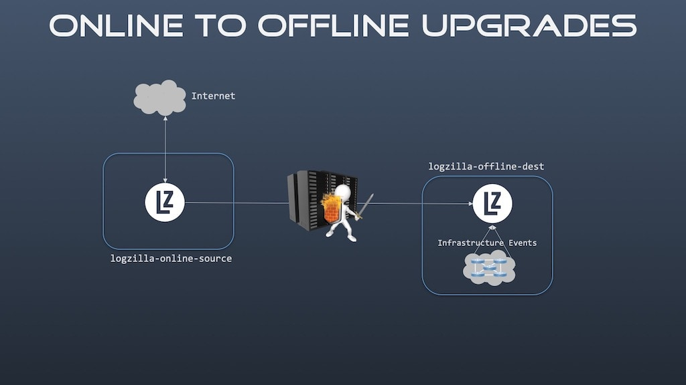
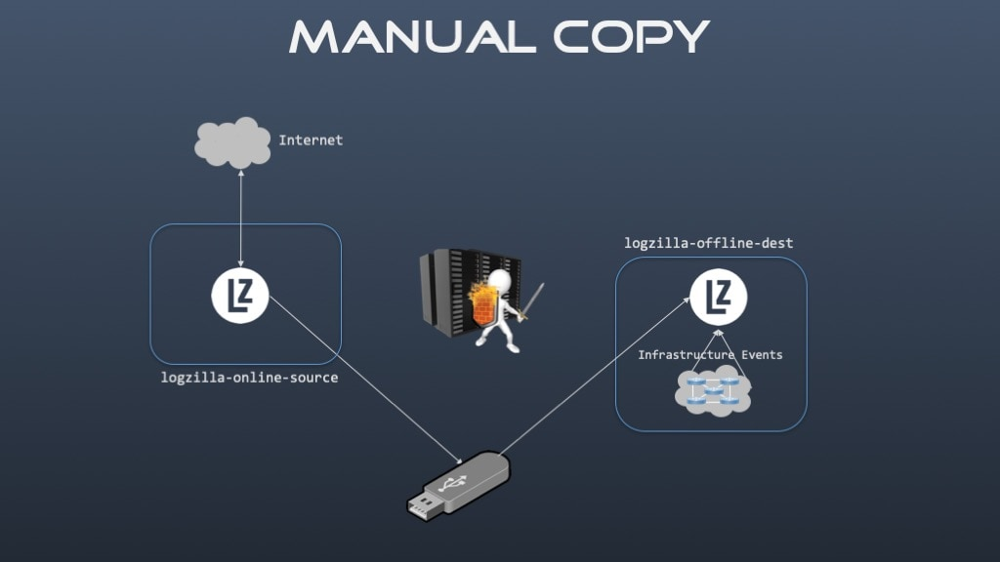

# Offline Upgrade Procedure

This document outlines various ways to update a LogZilla installation when the server is located in a secured environment with no internet access.

## Prerequisites
A server with internet access must be used in order to obtain the images which may then be manually copied to the secure server.
To install LogZilla on an internet connected host, follow the instructions [on our website](https://www.logzilla.net/download.html).

If you are unable to bring up a LogZilla server with internet access, please [let us know](https://www.logzilla.net/contact.html) and we will provide the images for you to download.

## Hostnames
For the purposes of this walk-through, we are upgrading the `logzilla-offline-dest` from `v6.6.2` to `v6.6.8` using two servers named:

* logzilla-online-source
* logzilla-offline-dest


### Option 1: Online-to-Offline

This option requires connectivity to the internet from `logzilla-online-source` and also requires connectivity from that server to the `logzilla-offline-dest`.

The benefit here is a direct copy vs. saving to the local disk and manually transferring the files.



To use this method, paste the following script on the `logzilla-online-source` server that has the most recent of LogZilla installed and running:

#### Requires
* pv
* ssh token-based authentication to `logzilla-offline-dest`

> Note the use of `pv ` here just as a convenience for gzip and transfer status. To install `pv`, simply run `apt install pv` in Ubuntu or `yum install pv` in RHEL/CentOS


##### logzilla-online-source script

```bash
#!/bin/bash
logzilla_offline_dest="192.168.28.134"

count=$(docker ps | grep lz_ | wc -l)
if [[ $count -lt 22 ]]; then
  echo "Please make sure all logzilla containers are running first"
  exit 1
fi
for image in `docker images | awk '{print $1":"$2}' | grep -v REPOS`
do
  docker save $image | pv -N "Compressing..." | \
    gzip | pv -N "Transferring to ${logzilla_offline_dest}..." | \
    ssh ${logzilla_offline_dest} 'gunzip | docker load'
done
```
##### Sample Output
```
root@logzilla-online-source [~]: # bash ./foo
Compressing...: 93.8MiB 0:00:08 [11.3MiB/s] [              <=>                                                                                        ]
Transferring to 192.168.28.134...: 28.4MiB 0:00:08 [3.43MiB/s] [           <=>                                                                        ]
Loaded image: logzilla/front:v6.6.8
Transferring to 192.168.28.134...: 0.00 B 0:00:02 [0.00 B/s] [<=>                                                                                     ]Transferring to 192.168.28.134...: 0.00 B 0:00:03 [0.00 B/s] [<=>                                                                                     ]Compressing...:  968MiB 0:01:16 [12.6MiB/s] [                                                                                         <=>             ]
Transferring to 192.168.28.134...:  318MiB 0:01:16 [4.13MiB/s] [                                                                         <=>          ]
Loaded image: logzilla/runtime:latest
Compressing...:  968MiB 0:01:15 [12.8MiB/s] [                                                                                         <=>             ]
Transferring to 192.168.28.134...:  318MiB 0:01:15 [4.19MiB/s] [                                                                         <=>          ]
Loaded image: logzilla/runtime:stable
Compressing...:  968MiB 0:01:17 [12.5MiB/s] [                                                                                       <=>               ]
Transferring to 192.168.28.134...:  318MiB 0:01:17 [4.11MiB/s] [                                                                       <=>            ]
Loaded image: logzilla/runtime:v6.6.8
Compressing...: 9.63MiB 0:00:01 [7.07MiB/s] [    <=>                                                                                                  ]
Transferring to 192.168.28.134...: 4.84MiB 0:00:01 [3.55MiB/s] [   <=>                                                                                ]
Loaded image: logzilla/mailer:v6.6.8
Compressing...:  480MiB 0:00:42 [11.4MiB/s] [                                                                   <=>                                   ]
Transferring to 192.168.28.134...:  178MiB 0:00:42 [4.25MiB/s] [                                                        <=>                           ]
Loaded image: logzilla/syslogng:v6.6.8
Compressing...:  133MiB 0:00:11 [11.3MiB/s] [                  <=>                                                                                    ]
Transferring to 192.168.28.134...: 52.1MiB 0:00:11 [4.39MiB/s] [              <=>                                                                     ]
Loaded image: influxdb:1.7.6-alpine
Compressing...: 40.1MiB 0:00:03 [10.4MiB/s] [      <=>                                                                                                ]
Transferring to 192.168.28.134...: 14.0MiB 0:00:03 [3.64MiB/s] [    <=>                                                                               ]
Loaded image: redis:5.0.3-alpine3.8
Compressing...: 72.1MiB 0:00:07 [10.0MiB/s] [            <=>                                                                                          ]
Transferring to 192.168.28.134...: 25.9MiB 0:00:07 [3.60MiB/s] [         <=>                                                                          ]
Loaded image: postgres:10.5-alpine
Transferring to 192.168.28.134...: 0.00 B 0:00:01 [0.00 B/s] [<=>                                                                                     ]Compressing...: 45.0MiB 0:00:04 [9.56MiB/s] [        <=>                                                                                              ]
Transferring to 192.168.28.134...: 14.8MiB 0:00:04 [3.15MiB/s] [      <=>                                                                             ]
Loaded image: telegraf:1.7.3-alpine
Compressing...: 20.0MiB 0:00:02 [8.78MiB/s] [      <=>                                                                                                ]
Transferring to 192.168.28.134...: 6.89MiB 0:00:02 [3.02MiB/s] [    <=>                                                                               ]
Loaded image: elcolio/etcd:latest
```
#### Upgrade
On the `logzilla-offline-dest` host, type:

```
logzilla upgrade --version v6.6.8
```

##### Sample Output:

```
root@logzilla-offline-dest [~]: # logzilla upgrade --version v6.6.8
 lz.manager INFO     Starting LogZilla upgrade to version 'v6.6.8'
 lz.setup   INFO     Setup init
 lz.containers.postgres INFO     Checking postgresql volumes setup...
 lz.docker  INFO     Removing unknown: []
 lz.docker  INFO     Remove_old: front, queryupdatemodule, feeder, celerybeat
 lz.docker  INFO     Remove_old: gunicorn, queryeventsmodule-1, parsermodule, celeryworker, triggersactionmodule, tornado, dictionarymodule, aggregatesmodule-1
 lz.docker  INFO     Remove_old: storagemodule-1
 lz.docker  INFO     Remove_old: logcollector
Operations to perform:
  Apply all migrations: admin, api, auth, contenttypes, django_celery_beat, sessions
Running migrations:
  No migrations to apply.
 lz.setup   INFO     Update group permissions
 lz.setup   INFO     Update internal triggers
 lz.setup   INFO     Update builtin dashboard
 lz.setup   INFO     Update builtin triggers
 lz.setup   INFO     Update builtin scripts
 lz.setup   INFO     Update builtin parser rules
 lz.docker  INFO     Start: logcollector
 lz.docker  INFO     Start: storagemodule-1
 lz.docker  INFO     Start: aggregatesmodule-1, celeryworker, dictionarymodule, parsermodule, gunicorn, queryeventsmodule-1, tornado, triggersactionmodule
 lz.docker  INFO     Start: celerybeat, feeder, front, queryupdatemodule
 lz.docker  INFO     Start: watcher
 lz.manager INFO     LogZilla successfully upgraded to version 'v6.6.8'
```


### Option 2: Manual Copy (a.k.a. Sneaker Net)



##### logzilla-online-source script

```bash
#!/bin/bash

count=$(docker ps | grep lz_ | wc -l)
if [[ $count -lt 22 ]]; then
  echo "Please make sure all logzilla containers are running first"
  exit 1
fi
mkdir -p lz_images/
for image in `docker images | awk '{print $1":"$2}' | grep -v REPOS`
do
  name=$(echo $image | sed 's|/|_|g')
  echo "Saving image as lz_images/${name}.tgz"
  docker save $image | gzip -c > "lz_images/${name}.tgz"
done
```

##### Sample Output:
```
root@logzilla-online-source [~]: # bash ./foo
Saving image as lz_images/logzilla_front:v6.6.8.tgz
Saving image as lz_images/logzilla_runtime:latest.tgz
Saving image as lz_images/logzilla_runtime:stable.tgz
Saving image as lz_images/logzilla_runtime:v6.6.8.tgz
Saving image as lz_images/logzilla_mailer:v6.6.8.tgz
Saving image as lz_images/logzilla_syslogng:v6.6.8.tgz
Saving image as lz_images/influxdb:1.7.6-alpine.tgz
Saving image as lz_images/redis:5.0.3-alpine3.8.tgz
Saving image as lz_images/postgres:10.5-alpine.tgz
Saving image as lz_images/telegraf:1.7.3-alpine.tgz
Saving image as lz_images/elcolio_etcd:latest.tgz
```
#### Save images to your USB/External Disk

The images from the script above will be saved in a directory named `lz_images/` from where you ran the script.

```
root@logzilla-online-source [~]: # ls lz_images/
elcolio_etcd:latest.tgz    logzilla_mailer:v6.6.8.tgz   logzilla_runtime:v6.6.8.tgz   redis:5.0.3-alpine3.8.tgz
influxdb:1.7.6-alpine.tgz  logzilla_runtime:latest.tgz  logzilla_syslogng:v6.6.8.tgz  telegraf:1.7.3-alpine.tgz
logzilla_front:v6.6.8.tgz  logzilla_runtime:stable.tgz  postgres:10.5-alpine.tgz
```

#### `logzilla-offline-dest`

Copy all files from your USB/external disk to the `logzilla-offline-dest` server then:

```bash
cd lz_images/
for file in `ls` *.tgz
do
  gunzip -c $file | docker load
done
logzilla upgrade --version v6.6.8
```
