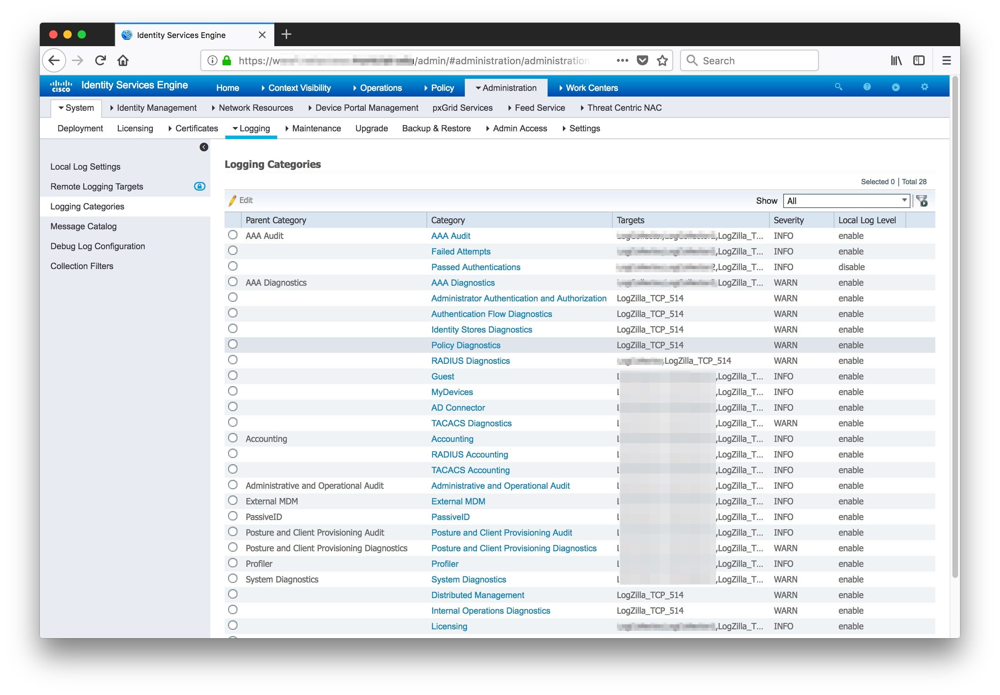

## Cisco ISE Package

This package greatly enhances the data sent from Cisco's Identity Services Engine.

The original ISE events sent by Cisco have a `Step=nnn` where `nnn` is an integer value.

Presumably, the reason Cisco does this is that:

1. It saves space in their local database to help their system scale better.
2. It lets them send more information to log receivers with fewer bytes.

Unfortunately, that also means that the end users are forced to look up Cisco's documentation on what each "Step" value means.

Instead, we've written a (very long) rule in syslog-ng that will rewrite each of these integer values into their original text.

All step values were obtained from [Cisco's documentation](https://www.cisco.com/c/dam/en/us/td/docs/security/ise/2-0/message_catalog/Cisco_Identity_Services_Engine_Log_Messages_20.xlsx).

There are over 2000 translations included so please pay attention to your server's health and make sure it can handle the load.

There may not be any impact, but these rules have not been tested under heavy load conditions.

# Installation

1. Copy the custom syslog-ng rule to the syslog volume:

> Note, if you already have any custom configs, you may want to merge the two - or at least make sure you only use a single `log{}` statement

```
cp -i syslog-ng/*.conf /var/lib/docker/volumes/lz_config/_data/syslog-ng/

```

2. Import rules:

> As of LogZilla NEO v6.5, rules may be written in either YAML or JSON

```
logzilla rules add rules.d/500-cisco-ise.json
logzilla rules add rules.d/998-lz-dst-ports.json
logzilla rules add rules.d/998-lz-src-ports.json
```

3. Import the dashboard:

```
logzilla dashboards import -I dashboards/cisco-ise-dashboard.json
```
4. Refresh your browser in the LogZilla NEO UI

# Cisco ISE Logs

Be sure to set up logging to your NEO server from within Cisco ISE.

##### Screenshot: ISE Categories




