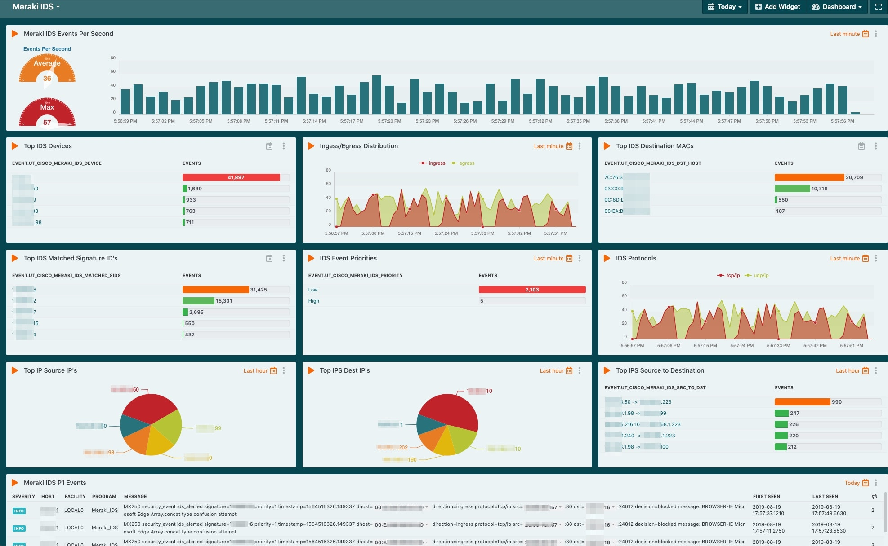
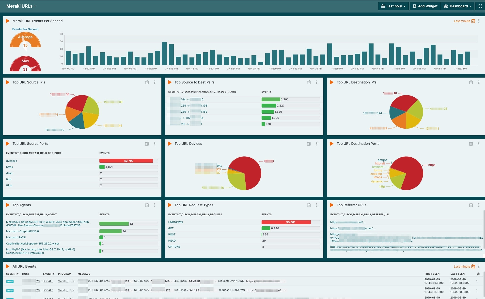
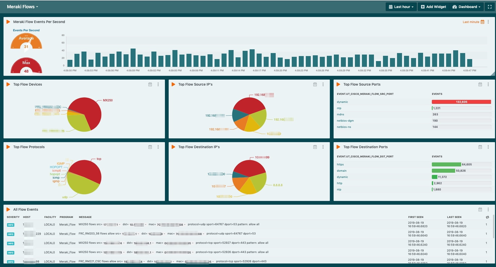
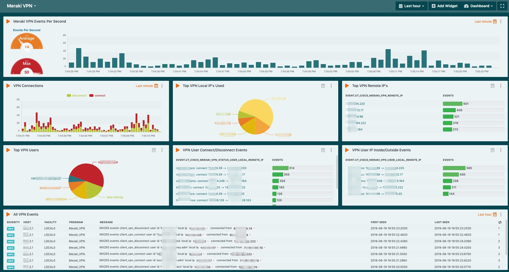
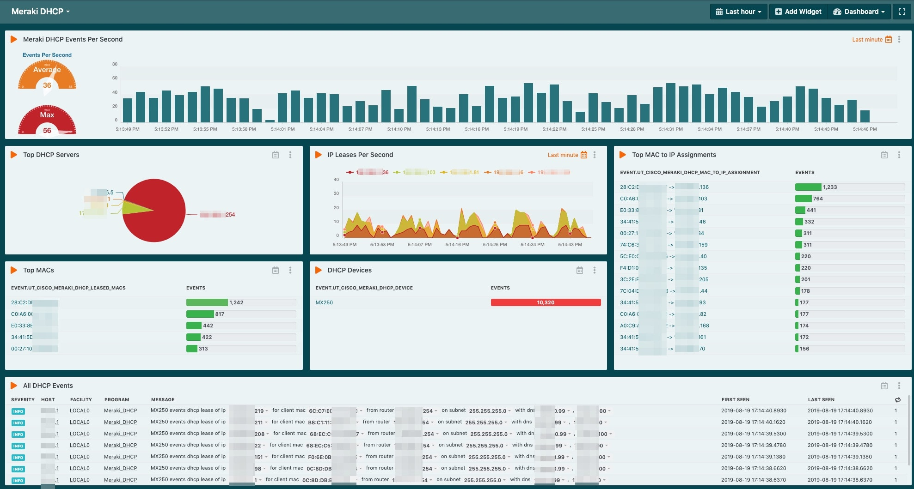
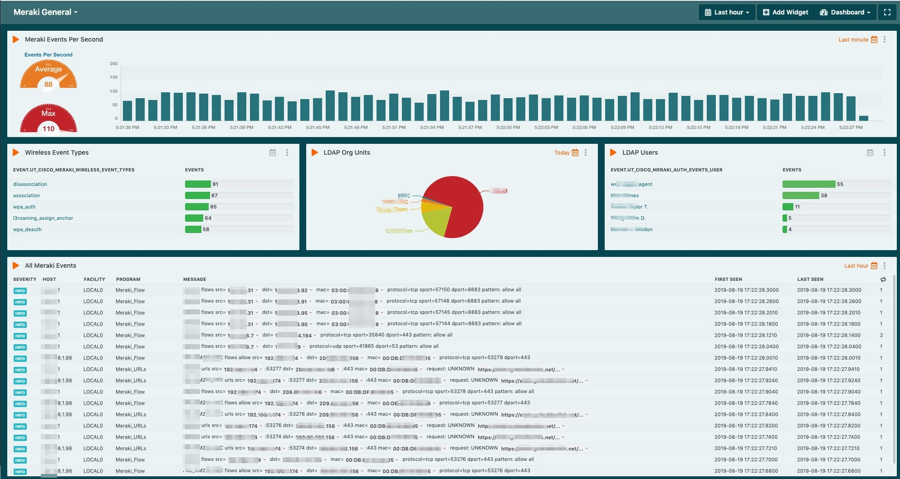

# Meraki

This package includes Dashboards, Rules, and Configs for Meraki Devices

Note that you must be using LogZilla NEO v6.6 or better for the rules to work

<font color="red">WARNING: There are a **lot** of rules here.</font> If your server is not properly sized, then you run the risk of causing problems. Please do not attempt to run these on a large network with something like a small/slow virtual machine.

You can test your server's capabilities by running `logzilla speedtest` or `logzilla rules performance`


# Sample Dashboards

##### Screenshot: Meraki IDS



##### Screenshot: Meraki URLs



##### Screenshot: Meraki Flows



##### Screenshot: Meraki VPN



##### Screenshot: Meraki DHCP



##### Screenshot: Meraki General



# Integration

1. Import rules:

> As of LogZilla NEO v6.5, rules may be written in either YAML or JSON

From this directory, paste the following (as the root user):

```
for rule in ls rules.d/*.yaml
do
  [ -f "${rule}" ] || continue
  logzilla rules add ${rule}
done
```

2. Import the dashboards:

From this directory, paste the following (as the root user):

```
for dashboard in dashboards/*.yaml
do
    [ -f "${dashboard}" ] || continue
    logzilla dashboards import -I ${dashboard}
done
```

1. Copy the custom syslog-ng rule to the syslog volume:

> Note, if you already have any custom configs, you may want to merge the two - or at least make sure you only use a single `log{}` statement

```
cp -i syslog-ng/*.conf /var/lib/docker/volumes/lz_config/_data/syslog-ng/
docker restart lz_syslog

```

3. Refresh your browser in the LogZilla NEO UI

