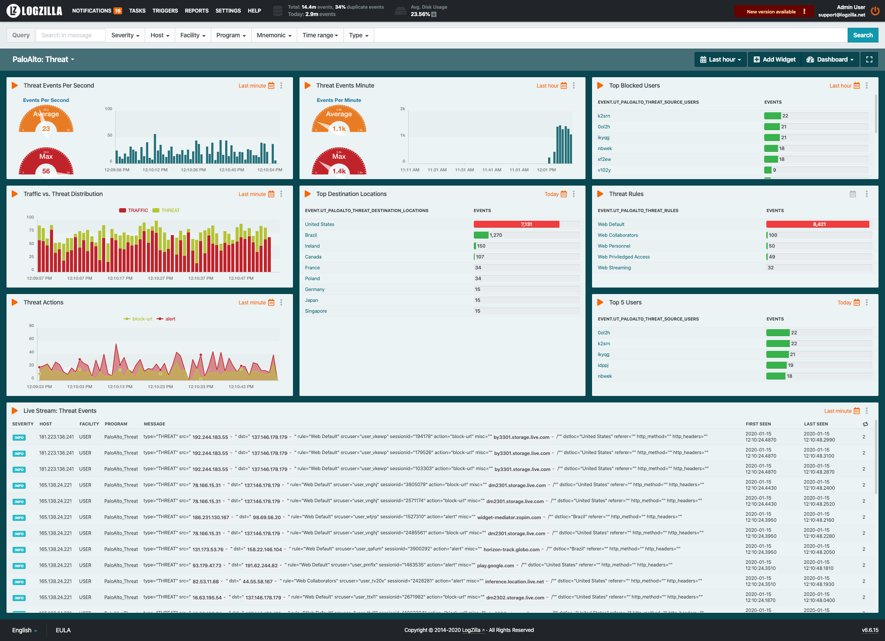

# PaloAlto
The following rules are used to gain insight from PAN-OS events.

* 700-paloalto-threat.yaml
* 700-paloalto-traffic.yaml

## Prerequisites
The PAN-OS sources must be configured properly in order for these rules to work.

1. Configure the device to include its IP address in the header of Syslog messages, select `Panorama/Device > Setup > Management`, click the Edit icon in the `Logging and Reporting Settings` section and navigate to the `Log Export and Reporting` tab. In the `Syslog HOSTNAME Format` drop-down select `ipv4-address`, then click `OK`.

2. Select `Server Profiles > Syslog` click `Add`

3. Enter a server profile `Name and Location` (location refers to a virtual system, if the device is enabled for virtual systems).

4. In the `Servers` tab, click `Add` and enter a Name, IP address (`Syslog Server` field), `Transport`, `Port` (default 514 for UDP), and `Facility` (default LOG_USER) for the Syslog server.

5. Select the `Custom Log Format` tab and select `Threat`, then paste the following values in the Custom Log Format area:

	```
	PaloAlto_Threat type="$type" src="$src" dst="$dst" rule="$rule" srcuser="$srcuser" sessionid="$sessionid" action="$action" misc="$misc" dstloc="$dstloc" referer="$referer" http_method="$http_method" http_headers="$http_headers"
	```

6. Select the `Custom Log Format` tab and select `Threat`, then paste the following values in the Custom Log Format area:

	```
	PaloAlto_Threat type="$type" src="$src" dst="$dst" rule="$rule" srcuser="$srcuser" sessionid="$sessionid" action="$action" misc="$misc" dstloc="$dstloc" referer="$referer" http_method="$http_method" http_headers="$http_headers"
	```

7. Select the `Custom Log Format` tab and select `Traffic`, then paste the following values in the Custom Log Format area:

	```
	PaloAlto_Traffic type="$type" src="$src" dst="$dst" natsrc="$natsrc" natdst="$natdst" rule="$rule" srcuser="$srcuser" from="$from" to="$to" sessionid="$sessionid" sport="$sport" dport="$dport" natsport="$natsport" natdport="$natdport" proto="$proto" action="$action" bytes="$bytes" packets="$packets" dstloc="$dstloc" action_source="$action_source"
	```

	Save and commit your changes.


# Load LogZilla Rules and Dashboards
1. Load each of the logzilla paloalto rules using the `logzilla rules add` command:

	```
	logzilla rules add 700-paloalto-threat.yaml
	logzilla rules add 700-paloalto-traffic.yaml
	```

2. Import the dashboards:

	```
	cd ../dashboards
	logzilla dashboards import -I palo-alto-threat.dashboard.json
	logzilla dashboards import -I palo-alto-traffic.dashboard.json
	```

Your dashboards will look similar to this:

##### Threat Dashboard



##### Traffic Dashboard


