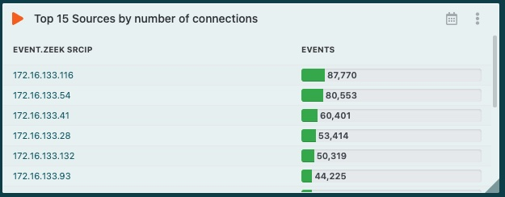
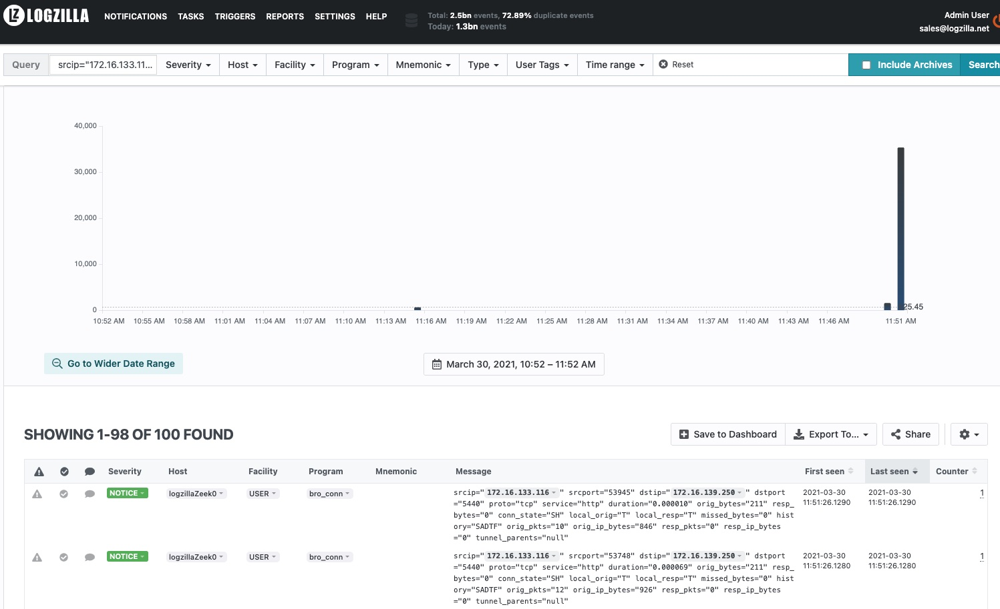
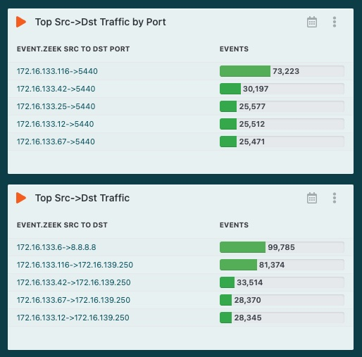
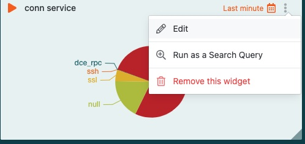
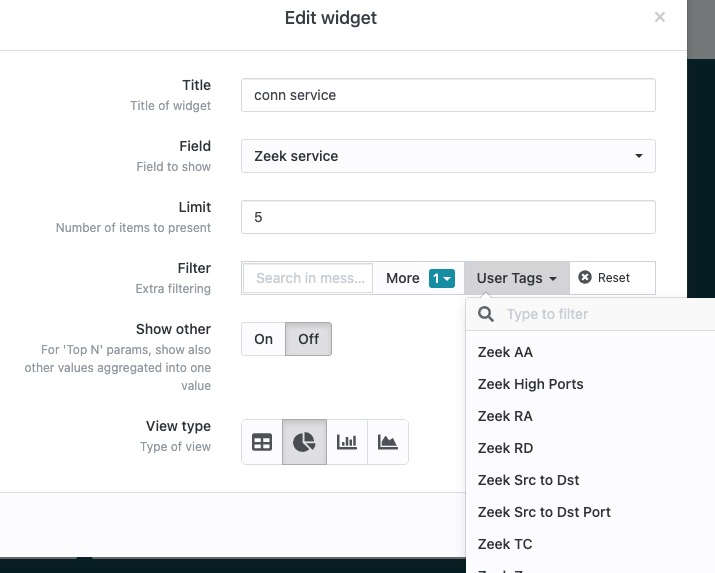
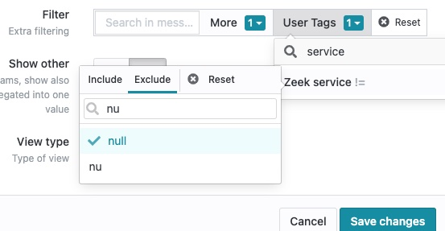
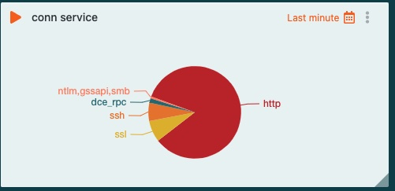
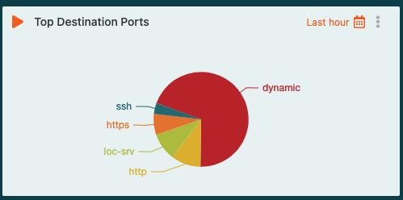

# Threat Hunting with Zeek and LogZilla

Our Goal with LogZilla is to make your job easier. Along these lines, we don't want you to have to use `awk`, `grep`, `sed` and **least** of all, `sql`. 

We took some examples of "Threat Hunting" from various places on the net to show examples of how much easier this is using LogZilla.

The first thing you should notice here is that many of the Threat Hunting day-to-day operations should not require any "hunting". Meaning, you don't have to run specific searches, they are already built in and tracked **in real-time**. 

For example, `find an specific IP from a source`. This would normally be a search in the command line or some UI from another product. Instead, you can see the `Top 15 Sources by number of connections` in the screenshot below.

For reference, [here's a breakdown](https://github.com/corelight/bro-cheatsheets/blob/master/Corelight-Bro-Cheatsheets-2.6.pdf) of available fields in Zeek logs.

## Sample Threat Hunting Dashboard


# Command Line vs. LogZilla

As noted, LogZilla makes it much easier for you than having to use command line tools. So comparisons are shown below for what it would take to use the command line on your Zeek server vs. just using LogZilla.


## Find connections that originate from the IP you're interested in

###### Zeek Command Line:
```
cat conn.log | zeek-cut -d ts id.orig_h id.resp_h id.resp_p proto conn_state duration | awk '$2 == "x.x.x.x"' > source_conn.txt
```

###### LogZilla:




### Find connections that originate from `172.16.133.116` but not the destination `172.16.130.4`

You can also specifically filter any widget, or even perform an easy search to get more granular. For example:

In the query bar, use:

```
srcip="172.16.133.116" ! dstip="172.16.130.4"
```


Which would produce search results similar to the screenshot below:





## Find connections that are destined for the IP you're interested in

Just like the `Find connections that originate from the IP you're interested in`, but with the destination IP vs. using the Source IP.


###### Zeek Command Line:
```
cat conn.log | zeek-cut -d ts id.orig_h id.resp_h id.resp_p proto conn_state duration | awk '$3 == "x.x.x.x"' > dest_conn.txt
```

###### LogZilla:


# Tracking Source to Destination Pairs

This may be used to identify unique IP's that have communicated with your address of interest for further analysis.

###### Zeek Command Line:
```
cat conn.log | zeek-cut -d ts id.orig_h id.resp_h id.resp_p proto conn_state duration | awk '$3 == "x.x.x.x"' > dest_conn.txt
```

###### LogZilla:

In LogZilla, you can also create Tags that will track paired items in real time. The two widgets below would track the Top Traffic by Port and the Top Traffic by Destination.




In LogZilla, this is done by extracting parts of messages and making them a "User Tag" - check the documentation for "User Tags" under `/help/data_transformation/user_tags` on your LogZilla server, or [on our demo site](http://demo.logzilla.net/help/data_transformation/user_tags).

Here's a sample rule for the Source to Dest User Tag:

```
- comment:
  - Tag Source to Destination Pairs
  match:
    field: message
    op: =~
    value: srcip="\d+.*dstip="\d+
  tag:
    Zeek Src to Dst: ${srcip}->${dstip}
```


# Service Discovery

Discover services used in network traffic (ftp, rdp, smb, ssh, ssl, kerberos etc.), eliminating dns and blank entries due to the noise


###### Zeek Command Line:
```
cat conn.log | zeek-cut -d ts id.orig_h id.resp_h service | awk '{if($4 != "dns" && $4 != "-") print $1,$2,$3,$4}'
```

Services list

```
cat conn.log | zeek-cut service | grep -v "-" | sort | uniq -c | sort -n
```

###### LogZilla:

Not only is this already available, but we've also mapped the well-known ports so that users don't have to guess what every port number is. For example, just about everyone recognizes port 22 as `ssh`, but not everyone knows that port 135 is `loc-srv`.

So rather than a command line list of numbers or a chart of numbers, you get something much easier to see:


Filtering `empty` values is a simple matter of changing the filter in the widget by selecting the hamburger menu (the 3 dots at the top right of a widget).




From the edit menu, filter by User Tags:




Search for `Zeek service` and choose `null`, then click `exclude`, then `Save Changes`





Now you have the services used in network traffic excluding items you don't care about.




# TopN Stats/Most talkative hosts

###### Zeek Command Line:
```
cat conn.log | zeek-cut id.orig_h | sort | uniq -c | sort -n | tail -n 5
```

IP’s that receive most traffic: 

```
cat conn.log | zeek-cut id.resp_h | sort | uniq -c | sort -n | tail -n 5
```

Longest duration's: 

```
cat conn.log | zeek-cut id.orig_h id.resp_h duration | sort -k 3 -rn | head -5
```

Top Destination ports: 
```
cat conn.log | zeek-cut id.resp_p| sort | uniq -c | sort -n | tail -n 5
```

###### LogZilla:

IP’s that receive most traffic: 


Longest duration's, including the rule used:

```
- comment:
  - Detect Long Duration Connections
  match:
    field: program
    op: =*
    value: bro_conn
    field: message
    op: =~
    value: srcip="\d+.*dstip="\d+.+duration="(\d*[3-9]+)\.\d+"
  tag:
    Zeek Long Durations: $1 Seconds
```


Top Destination ports:




# DNS Threats


To identify C2 communication, beacons, and other malicious DNS queries, remove normal internet and internal company related traffic.

> Note: be careful what you’re eliminating as C2’s have been established using common services like Twitter, Microsoft Teams, GitHub etc.

###### Zeek Command Line:

```
cat dns.log | zeek-cut -d ts id.orig_h id.resp_h query | grep -Ev '(microsoft|akamai|google|windowsupdate|msft|apple|comanyname)' > dns_queries.txt```
```

###### LogZilla:


# Summary

As you can see, threat hunting in LogZilla is so much easier with the added benefit of being real-time. You don't actually have to "hunt", all you need to do is look at the dashboard. 

To take this a step further, rather than even having to look at a dashboard, why not create some real-time triggers to not only alert on these, but [automatically go out to other tools and resources for investigation](http://demo.logzilla.net/help/creating_triggers/the_trigger_page)?


# Implementation

There are two ways to implement this:

1. Use the included rules and dashboards
2. Use the included script to generate rules and dashboards based on fields from your Zeek server.


# Option 1: Use pre-built rules and dashboards

## Rules via the "easy" button

If you want to just use the rules already generated (which would probably work fine without having to do all the scripts below), then just run:

```
./addrules_to_logzilla.sh
```
and skip the section below for using the `makerules.sh` script.

## Dashboards via the "easy" button

>CAUTION: If you import dashboards multiple times, it will create duplicate dashboards. Dashboards are not overwritten.
>So if there are 22 dashboards imported and you run the import again, you will have 26 dashboards.

To generate dashboards, use `-d` with `./makerules.sh` or just use the ones located in [dashboards](dashboards/):

Dashboards can be imported via command line using `logzilla dashboards import -I dashboards/filename.yaml`

or, to import all, run the following command:

```
for dash in dashboards/*.yaml
do
 logzilla dashboards import -I $dash
done
```

# Option 2: Custom Rules/Dashboards based on your environment

# Bro/Zeek Server setup
From your Bro/Zeek server, set file format to TSV

Edit:
```
vi /usr/local/zeek/share/zeek/site/local.zeek
```

Comment out the `json` logging line:

```
# Output in JSON format
#@load policy/tuning/json-logs.zeek
```

```
/usr/local/zeek/bin/zeekctl stop
/usr/local/zeek/bin/zeekctl deploy
```

### Get fields list from your zeek server

Option 1: 

Use the `fields.tsv` included here already

Option 2: 

On your Zeek server (not the logzilla server), perform the following:

> <font color="red"> NOTE: </font> Be sure to `cd` to the logs directory first, otherwise, parsing in `makerules.sh` will fail.

```
cd /usr/local/zeek/logs/current/
grep '^#' *.log >./fields.tsv
```

Next, upload the resulting `field.tsv` to your LogZilla server (this directory).

<font color="red"> WARNING: </font> **DO NOT** copy/paste the fields.tsv file since we need the tab separated values for parsing.


# Syslog-ng

RHEL/CentOS requires a more recent version of syslog-ng, the one in their repos is horribly old.

Also, you may get errors from `systemctl status syslog-ng` on RHEL/CentOS from about `Can't resolve to absolute path; path='/usr/local/zeek/logs/current', error='Permission denied (13)'`
I had to `setenforce permissive`. There's probably a better way to do it, but that's up to you :)

```
wget -O /etc/yum.repos.d/czanik-syslog-ng331-epel-7.repo 'https://copr.fedorainfracloud.org/coprs/czanik/syslog-ng331/repo/epel-7/czanik-syslog-ng331-epel-7.repo'
yum install -y syslog-ng
systemctl enable syslog-ng --now
yum -y erase rsyslog
```

## syslog-ng config

Use the syslog-ng config located [here](syslog-ng/zeek2logzilla.conf) on your Zeek server.

Replace the IP address in the line: `destination d_logzilla { tcp("1.2.3.4" port(514)); };` in the `zeek2logzilla.conf` file with your logzilla server's IP:

# Scripts

# makerules.sh

After you have your `fields` list from your zeek server, run:

```
./makerules.sh 
```

or, to include dashboard generation, run:

```
./makerules.sh -d
```

Then use the `./addrules_to_logzilla.sh` and the `dashboards import` methods described above.


# Added bonus

Some extra static rules have been included in [static](static/) for various things such as mapping port numbers to human friendly names. e.g.: port 22 shows as `ssh` in the UI instead of the number.

They will be added when running the `addrules_to_logzilla.sh` script.

